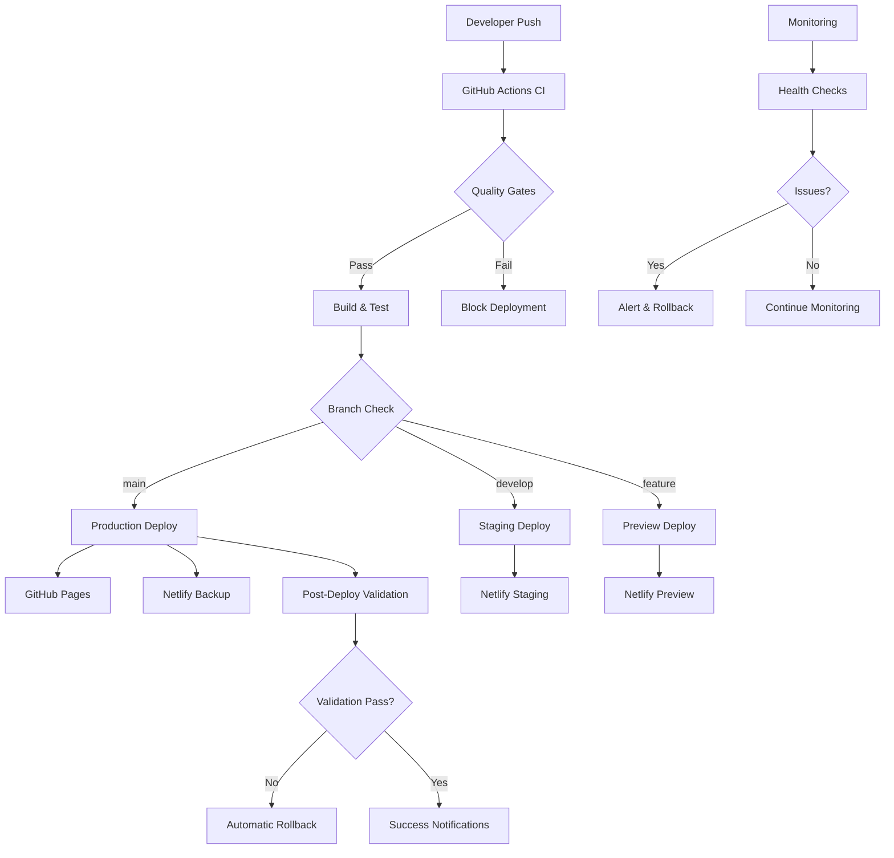

# CI/CD Pipeline Documentation

## Overview

BorderlessBits.com implements a comprehensive CI/CD pipeline that provides enterprise-grade deployment capabilities while maintaining zero-cost operations. The pipeline includes automated quality gates, multi-environment deployments, security scanning, performance monitoring, and automatic failover.

## Architecture



## Pipeline Components

### 1. Continuous Integration (CI)

**File**: `.github/workflows/ci.yml`

**Triggers**:
- Push to `main` or `develop` branches
- Pull requests to `main` or `develop`
- Daily scheduled security scans (3 AM UTC)
- Manual workflow dispatch

**Jobs**:
- **Quality Gates** (parallel execution)
  - ESLint code quality check
  - TypeScript compilation check
  - Prettier format validation
- **Security Audit**
  - NPM vulnerability scan
  - CodeQL static analysis
  - Trivy filesystem scanning
- **Unit & Integration Tests**
  - Jest test execution with coverage
  - Coverage reporting to Codecov
- **Build & Bundle Analysis**
  - Production build verification
  - Bundle size analysis and limits
  - Build artifact generation

**Performance**: ~10 minutes total execution time with parallel jobs

### 2. Production Deployment (CD)

**File**: `.github/workflows/deploy-production.yml`

**Triggers**:
- Push to `main` branch
- Manual workflow dispatch with force option

**Deployment Strategy**:
1. **Pre-deployment Validation**
   - Critical tests execution
   - Security audit (high/critical vulnerabilities block deployment)
   - Production build with optimizations
   - Bundle size validation (<2MB total)

2. **Primary Deployment**: GitHub Pages
   - Static site generation
   - Custom domain configuration
   - SSL certificate management
   - CDN optimization

3. **Backup Deployment**: Netlify
   - Automatic failover target
   - Independent deployment pipeline
   - Form handling capabilities
   - Branch deploy previews

4. **Post-deployment Validation**
   - Health checks with retries (10 attempts, 30s intervals)
   - Performance validation with Lighthouse
   - SEO assets verification (sitemap.xml, robots.txt)
   - SSL certificate validation

5. **Automatic Rollback**
   - Triggered on validation failures
   - Restores previous successful deployment
   - Notification system integration

**Performance**: ~5 minutes for successful deployment

### 3. Staging Environment

**File**: `.github/workflows/deploy-staging.yml`

**Purpose**: Production-like testing environment for validation before main deployment

**Features**:
- Automatic deployment on `develop` branch pushes
- Auto-promotion to production with `[auto-promote]` commit message
- Separate analytics configuration
- Staging-specific environment variables

### 4. Preview Deployments

**File**: `.github/workflows/preview-deploy.yml`

**Features**:
- Per-PR preview deployments
- Lighthouse performance audits
- Visual regression testing
- Automated PR comments with deployment links
- Cleanup on PR closure

## Quality Gates

### Code Quality
- **ESLint**: Enforces coding standards and catches potential bugs
- **TypeScript**: Type checking for enhanced reliability
- **Prettier**: Consistent code formatting
- **Test Coverage**: Minimum 80% unit test coverage

### Security
- **Dependency Scanning**: NPM audit for vulnerable packages
- **Static Analysis**: CodeQL for security vulnerabilities
- **Secrets Scanning**: TruffleHog and GitLeaks for exposed credentials
- **Container Scanning**: Trivy for Docker image vulnerabilities
- **Infrastructure Scanning**: Checkov for misconfigurations

### Performance
- **Bundle Size**: Maximum 2MB total JavaScript
- **Lighthouse Audits**: 
  - Performance: >80
  - Accessibility: >95
  - Best Practices: >90
  - SEO: >95
- **Core Web Vitals**:
  - LCP: <2.5s
  - FID: <100ms
  - CLS: <0.1

## Environment Configuration

### Production
- **Domain**: https://borderlessbits.com
- **Hosting**: GitHub Pages (primary), Netlify (backup)
- **Analytics**: Google Analytics 4
- **Forms**: EmailJS with Netlify Forms backup
- **Monitoring**: Uptime Robot, GitHub Actions monitoring

### Staging
- **Domain**: https://staging.borderlessbits.com
- **Hosting**: Netlify
- **Analytics**: Separate GA4 property
- **Forms**: Same as production with staging indicators
- **Auto-promotion**: Available with commit message flag

### Preview
- **Domain**: https://preview-pr-{number}.netlify.app
- **Hosting**: Netlify preview deployments
- **Analytics**: Disabled or staging configuration
- **Lifecycle**: Automatic cleanup on PR closure

## Security Implementation

### Secrets Management
- GitHub repository secrets for sensitive data
- Environment-specific secret management
- Automatic secret rotation capabilities
- Secrets validation in CI/CD pipeline

**Required Secrets**:
```
GA_MEASUREMENT_ID           - Google Analytics tracking
EMAILJS_SERVICE_ID          - Email service configuration
EMAILJS_TEMPLATE_ID         - Email template ID
EMAILJS_PUBLIC_KEY          - EmailJS public key
NETLIFY_AUTH_TOKEN          - Netlify deployment token
NETLIFY_SITE_ID             - Production site ID
NETLIFY_STAGING_SITE_ID     - Staging site ID
NETLIFY_PREVIEW_SITE_ID     - Preview deployments site ID
LHCI_GITHUB_APP_TOKEN       - Lighthouse CI integration
CODECOV_TOKEN               - Code coverage reporting
```

### Security Scanning
- **Scheduled Scans**: Daily security audits at 2 AM UTC
- **Dependency Monitoring**: Automated vulnerability detection
- **Container Security**: Multi-layer container scanning
- **Code Analysis**: Static application security testing (SAST)
- **Infrastructure**: Configuration and compliance scanning

## Monitoring & Alerting

### Health Monitoring
**File**: `.github/workflows/monitoring.yml`

**Schedule**:
- Business hours: Every 5 minutes (9 AM - 6 PM UTC, Mon-Fri)
- Off-hours: Every 15 minutes
- Weekends: Every 15 minutes

**Monitoring Checks**:
- **Uptime**: HTTP status and response time
- **Performance**: Lighthouse audits
- **SSL Certificates**: Expiration monitoring (30-day warning)
- **DNS Resolution**: Domain resolution validation
- **Security Headers**: Security configuration validation
- **Dependencies**: Vulnerability monitoring

### Alerting Strategy
- **Green Status**: All systems operational
- **Yellow Status**: Non-critical issues detected
- **Red Status**: Critical systems down or compromised

### Integration Points
- GitHub Actions workflow status
- Email notifications (configurable)
- Slack/Discord webhooks (configurable)
- PagerDuty integration (enterprise)

## Performance Optimization

### Build Optimization
- **Static Site Generation**: Next.js static export for optimal performance
- **Bundle Splitting**: Automatic code splitting for faster loading
- **Image Optimization**: Next.js Image component with WebP support
- **CSS Optimization**: PostCSS with autoprefixer and minification
- **Tree Shaking**: Unused code elimination

### Deployment Optimization
- **CDN Integration**: Cloudflare/GitHub Pages CDN
- **Compression**: Gzip/Brotli compression for assets
- **Caching Strategy**: Long-term caching for static assets
- **Preloading**: Critical resource preloading
- **Service Worker**: Offline capability (optional)

### Monitoring Integration
- **Real User Monitoring**: Core Web Vitals tracking
- **Performance Budgets**: Automated performance regression detection
- **Lighthouse CI**: Continuous performance validation

## Rollback Procedures

### Automatic Rollback
Triggered automatically when:
- Post-deployment health checks fail
- Performance thresholds are breached
- Security vulnerabilities detected in production

**Process**:
1. Detect failure condition
2. Identify last known good deployment
3. Restore previous build artifacts
4. Redeploy to all targets
5. Validate rollback success
6. Send failure notifications

### Manual Rollback
**Script**: `scripts/rollback.sh`

**Usage**:
```bash
# Rollback to latest backup
./scripts/rollback.sh

# Rollback to specific backup
./scripts/rollback.sh -b backup-20231201-143022

# List available backups
./scripts/rollback.sh -l
```

**Features**:
- Interactive confirmation prompts
- Backup listing and selection
- Cross-platform deployment
- Validation and health checks
- Emergency rollback capabilities

## Development Workflow

### Branching Strategy
```
main           ← Production deployments
develop        ← Staging deployments
feature/*      ← Preview deployments
hotfix/*       ← Emergency production fixes
```

### Pull Request Process
1. **Create Feature Branch**: `feature/description`
2. **Develop & Test**: Local development with Docker
3. **Create Pull Request**: Against `develop` or `main`
4. **Automated Checks**: CI pipeline validation
5. **Preview Deployment**: Automatic PR preview
6. **Code Review**: Team review process
7. **Merge & Deploy**: Automatic deployment trigger

### Local Development
**Docker Setup**: `docker-compose up`
- Hot reloading enabled
- Volume mounting for instant updates
- Database integration (if needed)
- Performance profiling tools

## Troubleshooting Guide

### Common Issues

**Build Failures**:
```bash
# Clear cache and rebuild
npm run clean
npm install
npm run build
```

**Deployment Failures**:
1. Check GitHub Actions logs
2. Verify secrets configuration
3. Validate environment variables
4. Check third-party service status

**Performance Issues**:
```bash
# Run performance analysis
npm run analyze
npm run lighthouse
```

**Security Issues**:
```bash
# Run security audit
npm audit --audit-level moderate
npm run security-check
```

### Emergency Procedures

**Critical Production Issue**:
1. Execute immediate rollback: `./scripts/rollback.sh -y`
2. Investigate root cause
3. Prepare hotfix
4. Deploy fix with validation
5. Post-incident review

**Security Breach**:
1. Rotate all secrets immediately
2. Execute security rollback
3. Audit access logs
4. Patch vulnerabilities
5. Security audit and validation

## Metrics & Analytics

### Deployment Metrics
- **Deployment Frequency**: Tracks release cadence
- **Lead Time**: Code commit to production time
- **Success Rate**: Percentage of successful deployments
- **Rollback Rate**: Frequency of rollback events
- **Recovery Time**: Time to resolve deployment issues

### Performance Metrics
- **Core Web Vitals**: LCP, FID, CLS tracking
- **Lighthouse Scores**: Performance, accessibility, SEO
- **Bundle Sizes**: JavaScript, CSS, image optimization
- **Load Times**: First contentful paint, time to interactive

### Security Metrics
- **Vulnerability Detection**: Time to identify issues
- **Resolution Time**: Time to patch vulnerabilities
- **Security Scan Coverage**: Percentage of code scanned
- **Compliance Score**: Security best practices adherence

## Cost Optimization

### Zero-Cost Architecture
- **GitHub Pages**: 100GB/month bandwidth (free)
- **Netlify**: 100GB/month bandwidth (free)
- **GitHub Actions**: 2000 minutes/month (free)
- **Uptime Robot**: 50 monitors (free)
- **Google Analytics**: Unlimited (free)

### Scaling Triggers
- **Traffic**: >100GB/month → Upgrade to paid tiers
- **Builds**: >2000 minutes/month → Optimize pipeline or upgrade
- **Forms**: >100 submissions/month → Netlify Pro ($19/month)
- **Monitoring**: >50 endpoints → Uptime Robot Pro ($7/month)

### Enterprise Migration Path
- **Vercel Pro**: $20/month for advanced deployment features
- **Netlify Pro**: $19/month for enhanced form processing
- **Custom Infrastructure**: AWS/Azure for full control and compliance

---

For support and questions about the CI/CD pipeline, contact: richard@borderlessbits.com

**Response Time**: Within 24 hours for deployment issues
**Emergency Contact**: Available for critical production issues