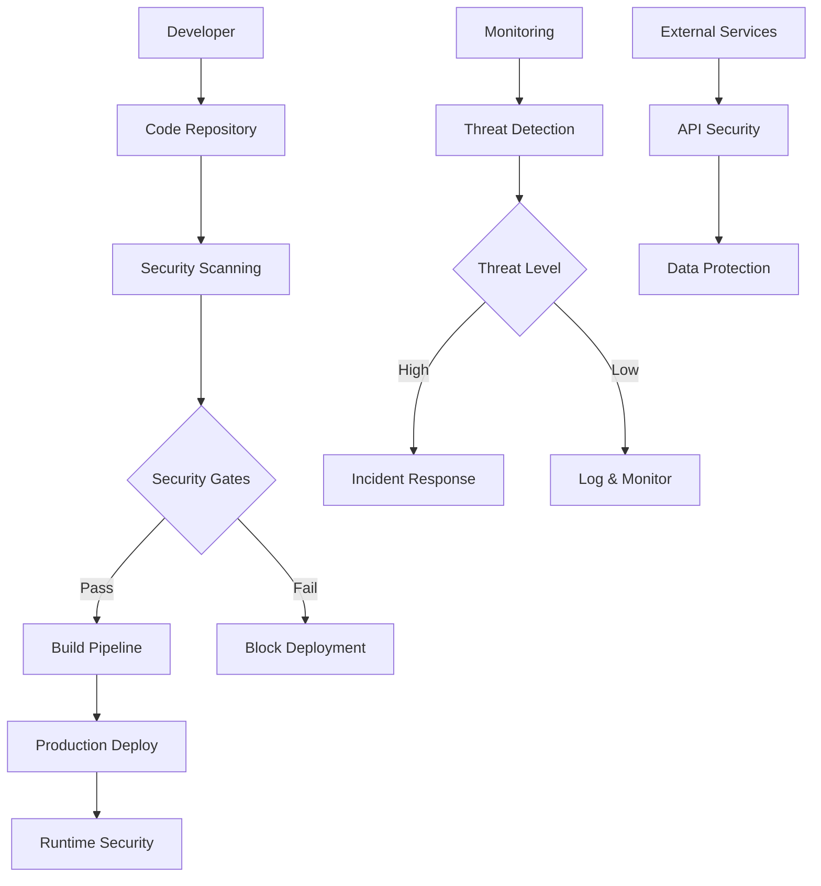

# Security Documentation

## Overview

BorderlessBits.com implements comprehensive security measures throughout the development lifecycle, deployment pipeline, and production infrastructure. This document outlines our security practices, threat model, and incident response procedures.

## Security Architecture



## Threat Model

### Assets
- **Source Code**: Application code, configurations, documentation
- **User Data**: Contact form submissions, analytics data
- **Infrastructure**: Deployment pipelines, hosting services
- **Brand Reputation**: Domain integrity, content authenticity
- **Service Availability**: Website uptime, form functionality

### Threat Actors
- **External Attackers**: Opportunistic hackers, script kiddies
- **Malicious Insiders**: Compromised developer accounts
- **Supply Chain**: Compromised dependencies, third-party services
- **Nation State**: Advanced persistent threats (low likelihood)

### Attack Vectors
- **Code Injection**: XSS, code injection via dependencies
- **Supply Chain**: Malicious NPM packages, compromised CDNs
- **Infrastructure**: Misconfigured services, credential theft
- **Social Engineering**: Phishing, account takeover
- **DDoS**: Service availability attacks

## Security Controls

### 1. Application Security

#### Input Validation & Sanitization
```typescript
// Contact form validation
import DOMPurify from 'isomorphic-dompurify';

export function sanitizeInput(input: string): string {
  return DOMPurify.sanitize(input, {
    ALLOWED_TAGS: [],
    ALLOWED_ATTR: []
  });
}

export function validateEmail(email: string): boolean {
  const emailRegex = /^[^\s@]+@[^\s@]+\.[^\s@]+$/;
  return emailRegex.test(email) && email.length <= 254;
}
```

#### Content Security Policy
```javascript
// next.config.js
const ContentSecurityPolicy = `
  default-src 'self';
  script-src 'self' 'unsafe-inline' https://www.google-analytics.com https://www.googletagmanager.com https://cdn.emailjs.com;
  style-src 'self' 'unsafe-inline' https://fonts.googleapis.com;
  font-src 'self' https://fonts.gstatic.com;
  img-src 'self' data: https: blob:;
  connect-src 'self' https://www.google-analytics.com https://api.emailjs.com;
  frame-src 'none';
  object-src 'none';
  base-uri 'self';
`;
```

#### Security Headers
```javascript
// Implemented in next.config.js
const securityHeaders = [
  {
    key: 'X-DNS-Prefetch-Control',
    value: 'on'
  },
  {
    key: 'X-XSS-Protection', 
    value: '1; mode=block'
  },
  {
    key: 'X-Frame-Options',
    value: 'SAMEORIGIN'
  },
  {
    key: 'X-Content-Type-Options',
    value: 'nosniff'
  },
  {
    key: 'Referrer-Policy',
    value: 'origin-when-cross-origin'
  },
  {
    key: 'Strict-Transport-Security',
    value: 'max-age=31536000; includeSubDomains'
  }
];
```

### 2. Infrastructure Security

#### GitHub Repository Security
- **Branch Protection**: Required reviews, status checks
- **Secret Scanning**: Automated credential detection
- **Dependency Scanning**: Automated vulnerability alerts
- **Code Scanning**: CodeQL security analysis

#### Hosting Security
**GitHub Pages**:
- Automatic HTTPS with TLS 1.2+
- DDoS protection via GitHub infrastructure
- Geographic content distribution
- Automatic security updates

**Netlify Backup**:
- SSL/TLS encryption with modern ciphers
- DDoS protection and rate limiting
- Form spam protection with honeypot fields
- Branch deploy isolation

#### DNS Security
- **DNSSEC**: Domain signing validation
- **CAA Records**: Certificate authority authorization
- **HSTS Preloading**: Forced HTTPS connections
- **Subdomain Protection**: Wildcard certificate validation

### 3. CI/CD Security

#### Pipeline Security
```yaml
# Secure pipeline configuration
permissions:
  contents: read
  security-events: write
  actions: read
  
concurrency:
  group: ${{ github.workflow }}-${{ github.ref }}
  cancel-in-progress: true
```

#### Secret Management
- **GitHub Secrets**: Encrypted storage for sensitive data
- **Environment Separation**: Different secrets per environment
- **Least Privilege**: Minimal required permissions
- **Regular Rotation**: Automated secret rotation capabilities

#### Build Security
- **Dependency Pinning**: Exact version specifications
- **Integrity Checking**: Package-lock.json verification
- **Supply Chain**: Verified publisher packages only
- **Sandboxed Builds**: Isolated build environments

### 4. Third-Party Security

#### Service Validation
- **EmailJS**: Validated service integration
- **Google Analytics**: Privacy-compliant configuration
- **Netlify**: Security-hardened deployment
- **CDN Services**: Subresource Integrity (SRI) validation

#### API Security
```typescript
// Rate limiting for form submissions
const RATE_LIMIT = {
  submissions: 5,
  window: 3600000, // 1 hour in milliseconds
};

export function rateLimitCheck(ip: string): boolean {
  const submissions = getSubmissions(ip, Date.now() - RATE_LIMIT.window);
  return submissions.length < RATE_LIMIT.submissions;
}
```

## Security Scanning

### Automated Security Testing

#### Dependency Scanning
**Daily Scans**: `npm audit --audit-level moderate`
- **Critical Vulnerabilities**: Block deployment
- **High Vulnerabilities**: Require immediate action
- **Moderate Vulnerabilities**: Schedule remediation
- **Low Vulnerabilities**: Monitor for updates

#### Static Application Security Testing (SAST)
**CodeQL Integration**:
```yaml
# .github/workflows/security-scan.yml
- uses: github/codeql-action/init@v3
  with:
    languages: javascript
    queries: security-extended,security-and-quality
```

**Custom Security Rules**:
- XSS prevention validation
- SQL injection pattern detection
- Hardcoded credential scanning
- Insecure random generation detection

#### Container Security Scanning
**Trivy Integration**:
```bash
# Multi-layer security scanning
trivy fs --security-checks vuln,config,secret .
trivy image borderlessbits:latest
```

#### Secret Scanning
**TruffleHog & GitLeaks**:
- Historical commit scanning
- Real-time credential detection
- Custom pattern matching
- False positive management

### Security Testing Results

#### Vulnerability Management
**Severity Levels**:
- **Critical**: Immediate response required (<4 hours)
- **High**: Response required (<24 hours)  
- **Medium**: Response required (<7 days)
- **Low**: Response required (<30 days)

**Remediation Process**:
1. **Detection**: Automated scanning identifies issue
2. **Assessment**: Security team evaluates risk and impact
3. **Planning**: Develop remediation strategy
4. **Implementation**: Apply security patches/updates
5. **Validation**: Verify fix effectiveness
6. **Documentation**: Record lessons learned

### Manual Security Testing

#### Penetration Testing
**Scope**: Web application security assessment
**Frequency**: Quarterly for production, monthly for staging
**Focus Areas**:
- Input validation vulnerabilities
- Authentication and session management
- Cross-site scripting (XSS) prevention
- Cross-site request forgery (CSRF) protection
- Information disclosure vulnerabilities

#### Security Headers Validation
```bash
# Automated security header testing
curl -I https://borderlessbits.com | grep -E "(X-Frame-Options|X-XSS-Protection|Content-Security-Policy|Strict-Transport-Security)"

# Security score validation
security-headers check https://borderlessbits.com
```

## Incident Response

### Incident Classification

#### Severity Levels
- **P0 - Critical**: Service unavailable, data breach, security compromise
- **P1 - High**: Significant functionality impacted, potential security risk
- **P2 - Medium**: Limited functionality impacted, minor security concern
- **P3 - Low**: Cosmetic issues, informational security findings

### Response Procedures

#### Security Incident Response Plan

**Phase 1: Detection & Analysis** (0-30 minutes)
1. **Incident Detection**: Automated alerts or manual discovery
2. **Initial Assessment**: Determine scope and severity
3. **Team Notification**: Alert security response team
4. **Evidence Preservation**: Secure logs and artifacts

**Phase 2: Containment** (30 minutes - 2 hours)
1. **Immediate Containment**: Isolate affected systems
2. **Damage Assessment**: Evaluate extent of compromise
3. **Short-term Containment**: Implement temporary fixes
4. **Communication**: Notify stakeholders as appropriate

**Phase 3: Eradication & Recovery** (2-24 hours)
1. **Root Cause Analysis**: Identify vulnerability source
2. **System Hardening**: Apply security patches
3. **Malware Removal**: Clean compromised systems
4. **Service Restoration**: Restore normal operations

**Phase 4: Post-Incident** (24-72 hours)
1. **Lessons Learned**: Document incident response
2. **Process Improvement**: Update security procedures  
3. **Training**: Enhance team capabilities
4. **Monitoring Enhancement**: Improve detection capabilities

### Emergency Contacts

**Security Team**:
- **Primary**: security@borderlessbits.com
- **Secondary**: richard@borderlessbits.com
- **Emergency**: +1-XXX-XXX-XXXX (24/7 response)

**External Resources**:
- **GitHub Security**: security@github.com
- **Netlify Security**: security@netlify.com
- **Legal Counsel**: [Legal firm contact]
- **Law Enforcement**: Local FBI field office

## Compliance & Privacy

### Data Protection

#### Data Collection
**Personal Information Collected**:
- Name and email address (contact form)
- IP address (analytics and rate limiting)
- Browser information (analytics)
- Usage patterns (analytics)

**Data Processing Purposes**:
- Business communication
- Website performance optimization  
- Security monitoring
- Legal compliance

#### Privacy Controls
```typescript
// Privacy-compliant analytics
gtag('config', 'GA_MEASUREMENT_ID', {
  anonymize_ip: true,
  allow_ad_personalization_signals: false,
  allow_google_signals: false,
  send_page_view: false // Manual page view tracking
});
```

#### Data Retention
- **Contact Forms**: 2 years for business purposes
- **Analytics Data**: 26 months (Google Analytics default)
- **Security Logs**: 1 year for incident response
- **Backup Data**: 30 days for operational recovery

### Regulatory Compliance

#### GDPR Compliance (EU)
- **Lawful Basis**: Legitimate interest for business communication
- **Data Subject Rights**: Access, rectification, erasure, portability
- **Privacy Notice**: Clear data processing disclosure
- **Data Protection Impact Assessment**: Low-risk processing

#### CCPA Compliance (California)
- **Consumer Rights**: Access, deletion, opt-out of sale
- **Data Categories**: Contact information, analytics data
- **Business Purposes**: Communication, website optimization
- **Third-Party Sharing**: Limited to service providers

### Security Compliance

#### Security Frameworks
**OWASP Top 10**: Protection against common vulnerabilities
- A01:2021 – Broken Access Control
- A02:2021 – Cryptographic Failures  
- A03:2021 – Injection
- A04:2021 – Insecure Design
- A05:2021 – Security Misconfiguration

**Security Controls Framework**:
- **Preventive Controls**: Input validation, access controls
- **Detective Controls**: Security monitoring, audit logging
- **Corrective Controls**: Incident response, patch management
- **Compensating Controls**: Additional security layers

## Security Monitoring

### Continuous Monitoring

#### Security Metrics
- **Vulnerability Count**: Track by severity level
- **Incident Response Time**: Mean time to detection/resolution  
- **Security Scan Coverage**: Percentage of code/dependencies scanned
- **False Positive Rate**: Security alert accuracy measurement

#### Automated Monitoring
```yaml
# GitHub Actions security monitoring
schedule:
  - cron: '0 2 * * *'  # Daily security scan at 2 AM UTC

jobs:
  security_scan:
    runs-on: ubuntu-latest
    steps:
      - uses: github/codeql-action/analyze@v3
      - uses: aquasecurity/trivy-action@master  
      - uses: trufflesecurity/trufflehog@main
```

#### Real-time Alerts
- **Deployment Failures**: Security scan failures
- **Unusual Activity**: Suspicious traffic patterns
- **Service Degradation**: Performance/availability issues
- **Configuration Changes**: Infrastructure modifications

### Security Reporting

#### Regular Reports
- **Weekly**: Vulnerability status, incident summary
- **Monthly**: Security metrics, compliance status  
- **Quarterly**: Security assessment, risk evaluation
- **Annual**: Security program review, threat landscape

#### Incident Reporting
- **Internal**: Security team, management
- **External**: Customers (if applicable), regulators
- **Public**: Security advisories (if applicable)
- **Vendors**: Third-party service providers

## Security Training

### Developer Security Training

#### Secure Coding Practices
- **Input Validation**: Proper sanitization techniques
- **Output Encoding**: XSS prevention methods
- **Authentication**: Secure session management
- **Authorization**: Access control implementation
- **Cryptography**: Proper encryption usage

#### Security Tools Training  
- **SAST Tools**: CodeQL, ESLint security rules
- **Dependency Scanning**: npm audit, Snyk
- **Container Security**: Trivy, Docker security
- **Secret Management**: GitHub secrets, environment variables

### Incident Response Training
- **Tabletop Exercises**: Simulated security incidents
- **Communication Protocols**: Escalation procedures
- **Technical Response**: Containment and recovery
- **Documentation**: Incident reporting and analysis

## Appendix

### Security Checklist

#### Development Security
- [ ] Input validation implemented
- [ ] Output encoding configured  
- [ ] Security headers deployed
- [ ] Dependencies up to date
- [ ] Secrets properly managed
- [ ] Code security scanned

#### Infrastructure Security  
- [ ] HTTPS enforced
- [ ] DNS security configured
- [ ] Access controls implemented
- [ ] Monitoring enabled
- [ ] Backup procedures tested
- [ ] Incident response plan current

#### Operational Security
- [ ] Security training completed
- [ ] Procedures documented
- [ ] Emergency contacts updated
- [ ] Compliance verified
- [ ] Risk assessment current
- [ ] Third-party security validated

### Security Tools & Resources

#### Automated Security Tools
- **GitHub Advanced Security**: CodeQL, secret scanning, dependency review
- **Trivy**: Container and filesystem vulnerability scanning  
- **TruffleHog**: Secret detection in code repositories
- **Lighthouse**: Security and accessibility auditing
- **OWASP ZAP**: Web application security testing

#### Security Resources
- **OWASP**: Web application security guidelines
- **NIST Cybersecurity Framework**: Security risk management
- **GitHub Security Lab**: Security research and tools
- **Mozilla Observatory**: Web security assessment
- **Security Headers**: HTTP security header analyzer

---

## Contact Information

**Security Team**: security@borderlessbits.com  
**Emergency Contact**: +1-XXX-XXX-XXXX (24/7 security hotline)  
**Responsible Disclosure**: security@borderlessbits.com  
**Bug Bounty**: Currently not available (future consideration)

**Response Times**:
- **Critical Security Issues**: <4 hours
- **High Severity Issues**: <24 hours
- **General Security Questions**: <72 hours

For security vulnerabilities, please use responsible disclosure practices and contact our security team directly rather than opening public issues.